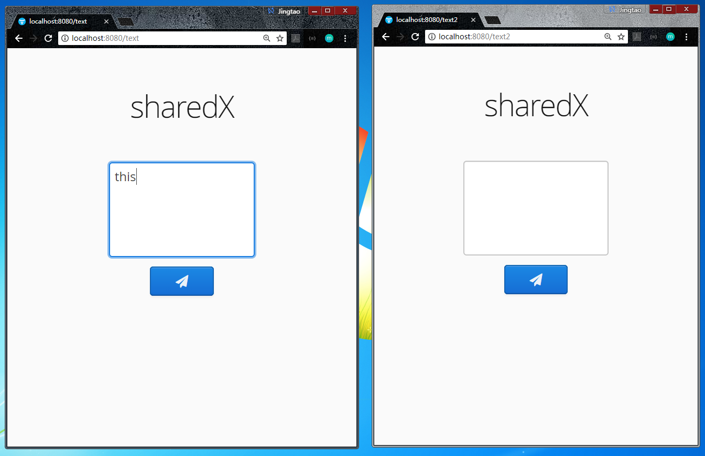
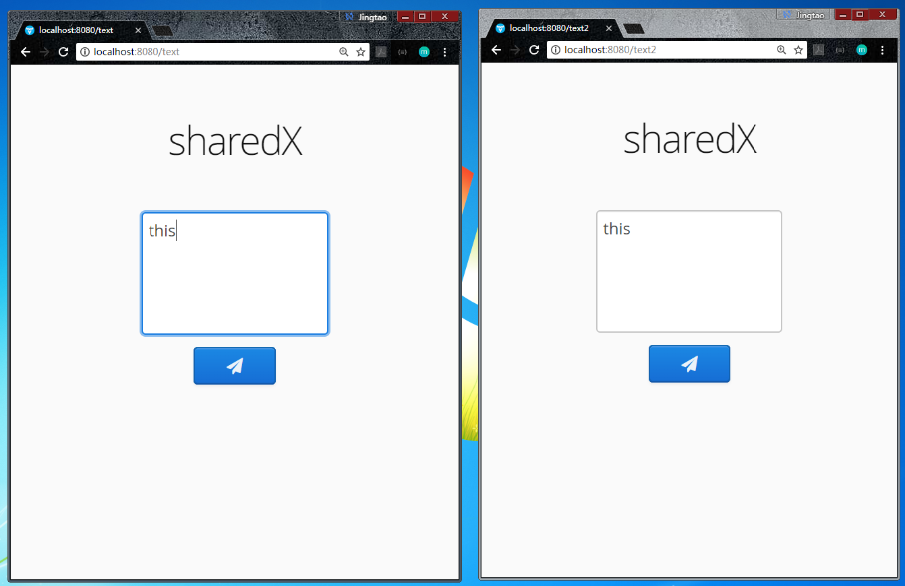
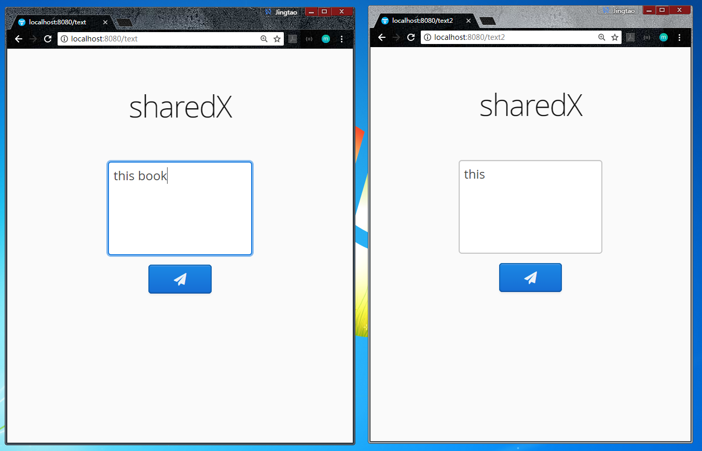
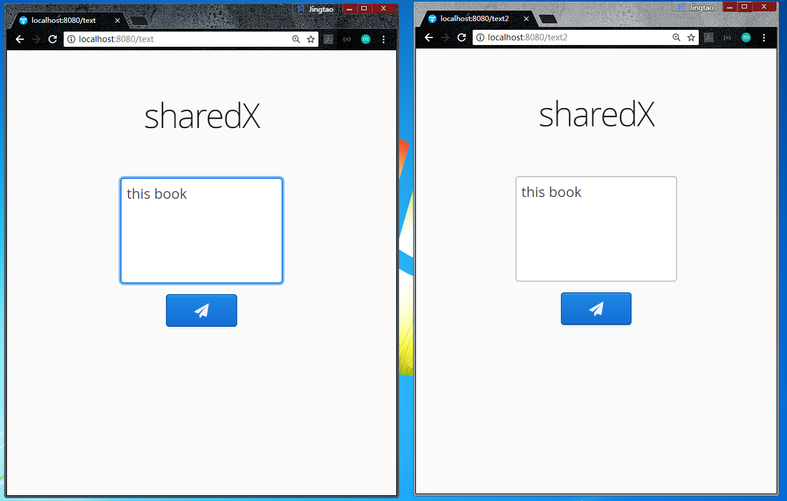
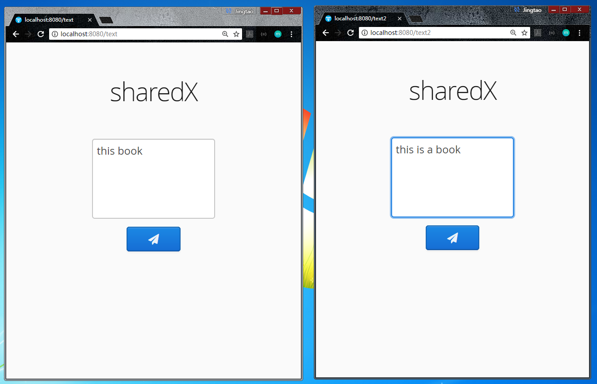
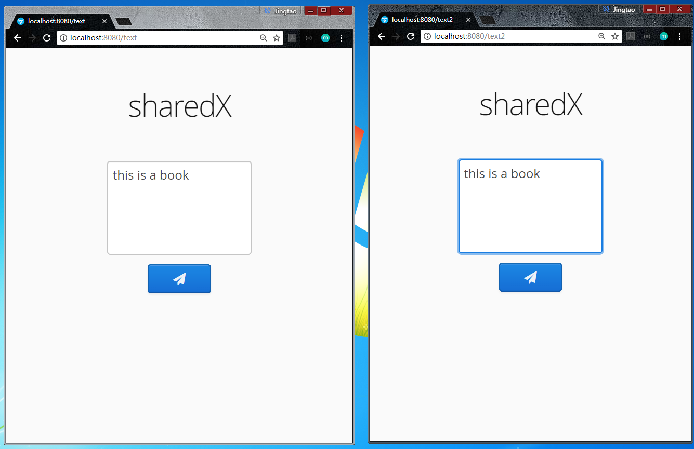

# SharedX
## A Collaborative shared text editor

### Technologies
* Spring
* MongoDB
* Netty
* Vaadin
* Operational Transformation
* Thread-safe operation queue: condition variable

### Structure
#### Server
Back-end, exchange client local operations

#### Client
Editor, send local operations to server & receive other clients operations from server. Apply *operational transformation* between lcoal operations
with received ones & render merged text to editor

### Demo
Open two client editors. Input text on the left.

Wait a second, right editor will be synchronized.

Input something into left editor.

Wait a second, right editor will be synchronized again.

Insert into arbitrary positon on right.

Left editor will also be synchronized in a second.

